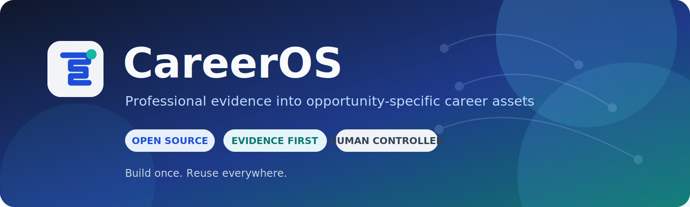
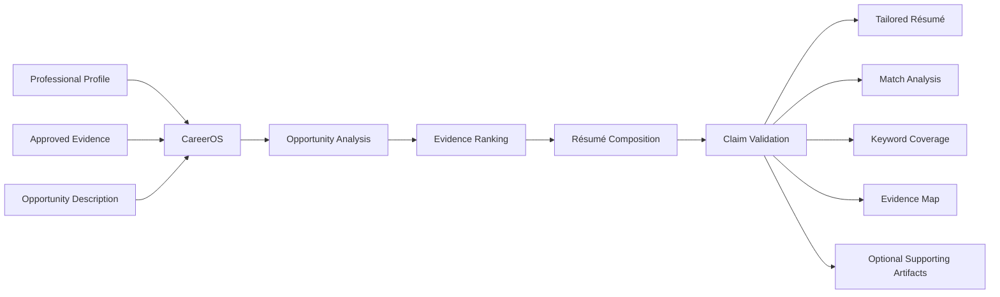
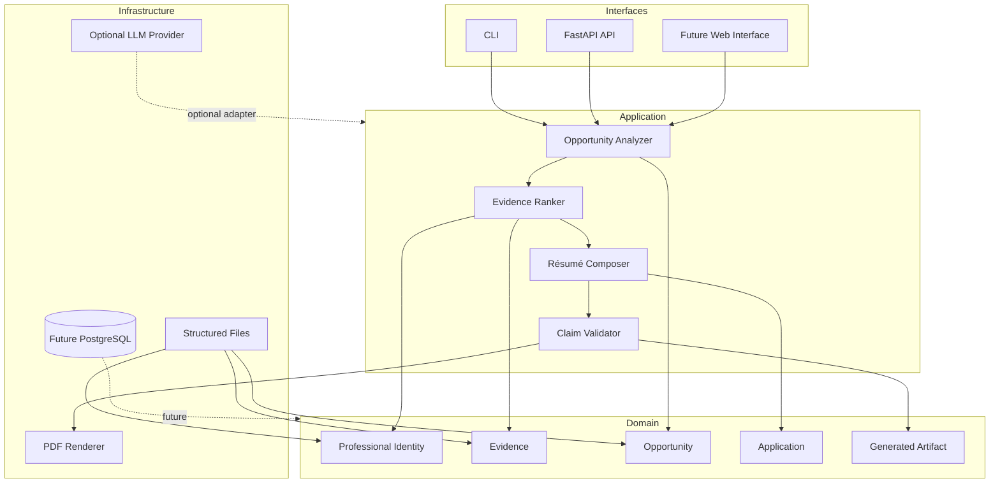

# CareerOS

<p align="center">
  
</p>

<p align="center">
  <strong>An open-source Career Intelligence Platform that transforms professional evidence into opportunity-specific career assets.</strong>
</p>

<p align="center">
  Build once. Reuse everywhere.
</p>

<p align="center">
  <a href="LICENSE">
    
  </a>
  
  
  
</p>

---

## Why CareerOS?

Professionals constantly rewrite the same career history.

The same experiences, skills and achievements are manually adapted for résumés, applicant tracking systems, LinkedIn, Upwork, portfolios, biographies, cover letters and application forms.

This process is repetitive, inconsistent and difficult to maintain.

CareerOS addresses this problem by creating a structured, reusable and evidence-based source of professional truth capable of generating multiple career assets while preserving traceability, privacy and user control.

## Current MVP

CareerOS is currently validating its first capability: the **Opportunity Tailoring Engine**.

It receives a structured professional profile, approved evidence and a specific opportunity. It then ranks the most relevant information and generates an application package that can be reviewed and approved by the user.



### MVP outputs

- ATS-oriented résumé;
- opportunity match analysis;
- evidence map;
- keyword coverage report;
- optional cover letter;
- optional application-form responses;
- optional interview preparation notes.

The first real-world validation case is an international Subject Matter Expert opportunity focused on Microsoft Fabric, Power BI, SQL Server, Azure data technologies and technical content review.

## Long-term vision

CareerOS is not merely a résumé generator.

It is evolving toward a **Career Operating System**.

Instead of maintaining several disconnected profiles and documents, professionals will maintain one trusted, structured and continuously evolving professional knowledge base. Every career asset becomes a generated and explainable view of that knowledge.

Future outputs may include:

- international résumé;
- ATS résumé;
- LinkedIn profile;
- Upwork profile;
- GitHub profile;
- professional portfolio;
- executive biography;
- speaker bio;
- media kit;
- cover letters;
- interview answers;
- application-form responses;
- personal website.

## Guiding principles

CareerOS is built around non-negotiable product and engineering principles:

- **Evidence first:** professional claims should be supported by identifiable evidence.
- **Human controlled:** users review and approve externally used outputs.
- **No fabrication:** CareerOS must not invent experience, certifications or results.
- **Explainable AI:** generated recommendations and selections should be reviewable.
- **Privacy by design:** only the minimum necessary information should be processed.
- **User-owned career data:** professionals retain control over their information.
- **Open source:** core capabilities, interfaces and governance should be inspectable.
- **Vendor neutral:** the domain must not depend on one cloud or AI provider.
- **Modular architecture:** integrations should be replaceable through ports and adapters.
- **Multilingual by design:** language is explicit metadata, not an afterthought.
- **Accessible and inclusive:** the platform should support diverse career paths and backgrounds.

## High-level architecture

CareerOS follows:

- Domain-Driven Design;
- Clean Architecture;
- Hexagonal Architecture;
- evolutionary and event-oriented design;
- explicit evidence provenance;
- AI-assisted, human-reviewed workflows.



The domain remains independent from frameworks, databases, cloud providers, document renderers and AI vendors.

## Repository structure

```text
apps/
├── api/                    # FastAPI entry point

packages/
├── domain/                 # Entities, value objects and domain rules
├── application/            # Use cases and orchestration
├── infrastructure/         # External adapters and providers
└── agents/                 # Future specialized AI capabilities

tests/                      # Automated tests
docs/                       # Product, architecture and governance documentation
.github/                    # GitHub workflows and contribution templates
```

The documentation is organized into:

```text
docs/
├── vision/
├── product/
├── architecture/
├── domain/
├── roadmap/
├── governance/
├── community/
├── mvp/
├── open-collective/
└── adr/
```

## Documentation

The documentation is organized around questions rather than technologies.

| Area | Question answered |
|---|---|
| [Vision](docs/vision/vision.md) | Why does CareerOS exist? |
| [Mission](docs/vision/mission.md) | What does CareerOS do now? |
| [Principles](docs/vision/principles.md) | Which values guide decisions? |
| [MVP](docs/product/mvp.md) | What is the smallest valuable product? |
| [Architecture](docs/architecture/overview.md) | How is the system organized? |
| [Domain model](docs/domain/domain-model.md) | What are the core business concepts? |
| [Roadmap](docs/roadmap/roadmap.md) | How will the platform evolve? |
| [Governance](docs/governance/governance.md) | How are decisions made? |
| [Funding transparency](docs/governance/funding-transparency.md) | How should project resources be handled? |
| [ADRs](docs/adr/) | Why were significant decisions made? |

## Quick start

### Requirements

- Python 3.14 or newer;
- Git;
- a supported virtual environment;
- Docker is optional.

### Linux and macOS

```bash
git clone https://github.com/saascoop-org/careeros.git
cd careeros

python -m venv .venv
source .venv/bin/activate

python -m pip install --upgrade pip
python -m pip install -r requirements-dev.txt

python -m uvicorn apps.api.main:app --reload
```

### Windows PowerShell

```powershell
git clone https://github.com/saascoop-org/careeros.git
cd careeros

py -3.14 -m venv .venv
.\.venv\Scripts\Activate.ps1

python -m pip install --upgrade pip
python -m pip install -r requirements-dev.txt

python -m uvicorn apps.api.main:app --reload
```

### Validate the installation

```bash
python -m pytest
python -m ruff check .
python -m mypy apps packages
```

### Local endpoints

- Swagger UI: `http://127.0.0.1:8000/docs`
- Health check: `http://127.0.0.1:8000/health`

## Roadmap

| Phase | Capability | Status |
|---|---|---|
| 0 | Repository and documentation foundation | Complete |
| 1 | Opportunity Tailoring Engine | In progress |
| 2 | Reusable Professional Knowledge Base | Planned |
| 3 | Career Intelligence | Planned |
| 4 | Connectors and interoperability | Planned |
| 5 | Knowledge graph and specialized agents | Planned |
| 6 | CareerOS platform | Planned |

See the complete [capability roadmap](docs/roadmap/roadmap.md) and [proposed milestones](docs/roadmap/milestones.md).

## Current status

The project is currently focused on:

- architecture and governance foundation;
- MVP validation;
- structured professional and opportunity schemas;
- evidence provenance;
- the first tailored international résumé;
- an anonymized or consent-based Upwork SME case study.

CareerOS is under active early development. Interfaces and schemas may change while the MVP is validated.

## Governance

CareerOS is an independent open-source project developed within the SaaSCoop ecosystem.

Project evolution is guided by:

- public roadmap;
- Architecture Decision Records;
- transparent governance;
- documented funding principles;
- open issues and pull requests;
- community contributions.

The project does not require FreireAI or another SaaSCoop initiative to perform its core responsibilities. Future integrations must remain optional and contract-based.

## Contributing

Contributions are welcome across software engineering, architecture, HR and ATS research, documentation, privacy, accessibility, design, testing and translation.

Before contributing, please read:

- [Contributing Guide](CONTRIBUTING.md)
- [Code of Conduct](CODE_OF_CONDUCT.md)
- [Security Policy](SECURITY.md)
- [Governance](docs/governance/governance.md)

Look for issues labeled `good first issue` or `help wanted`.

## Security and privacy

CareerOS may process personal and professional information.

Do not commit:

- private résumés;
- personal identification documents;
- credentials or API keys;
- confidential opportunity information;
- private professional evidence without explicit consent.

Security concerns should be reported according to the [Security Policy](SECURITY.md).

## License

CareerOS is licensed under the [MIT License](LICENSE).

---

<p align="center">
  Maintained as an open-source initiative within the <strong>SaaSCoop ecosystem</strong>.
</p>
