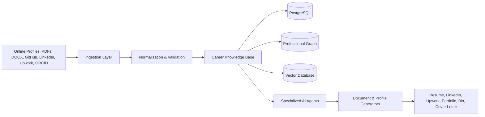

# CareerOS

CareerOS is an open source Career Intelligence Platform designed to transform a professional history into a living, structured, reusable and continuously updated career knowledge base.

It helps generate personalized career artifacts such as international resumes, ATS resumes, LinkedIn profiles, Upwork profiles, cover letters, biographies, portfolios, media kits and interview answers.

## Vision

CareerOS should become a career operating system where a resume is only one possible output. The core asset is a verified, multilingual and evolving professional knowledge graph.

## Core principles

- Privacy by design
- User-owned career data
- Open source governance
- Modular architecture
- Auditability and traceability
- Multilingual support
- Human-in-the-loop validation
- Agent-based automation
- Interoperability with public professional platforms

## Initial architecture

CareerOS follows Clean Architecture, DDD and Hexagonal Architecture.



## Main modules

- `apps/api`: FastAPI backend
- `packages/domain`: domain entities and value objects
- `packages/application`: use cases and orchestration
- `packages/infrastructure`: external integrations, databases and providers
- `packages/agents`: specialized career agents
- `docs`: architecture, ADRs, roadmap and governance

## Local development

```bash
python -m venv .venv
source .venv/bin/activate  # Linux/macOS
pip install -r requirements-dev.txt
uvicorn apps.api.main:app --reload
```

On Windows PowerShell:

```powershell
python -m venv .venv
.\.venv\Scripts\Activate.ps1
pip install -r requirements-dev.txt
uvicorn apps.api.main:app --reload
```

## Roadmap

See [`docs/roadmap.md`](docs/roadmap.md).

## Architecture decisions

See [`docs/adr`](docs/adr).

## License

This project is licensed under the MIT License.
