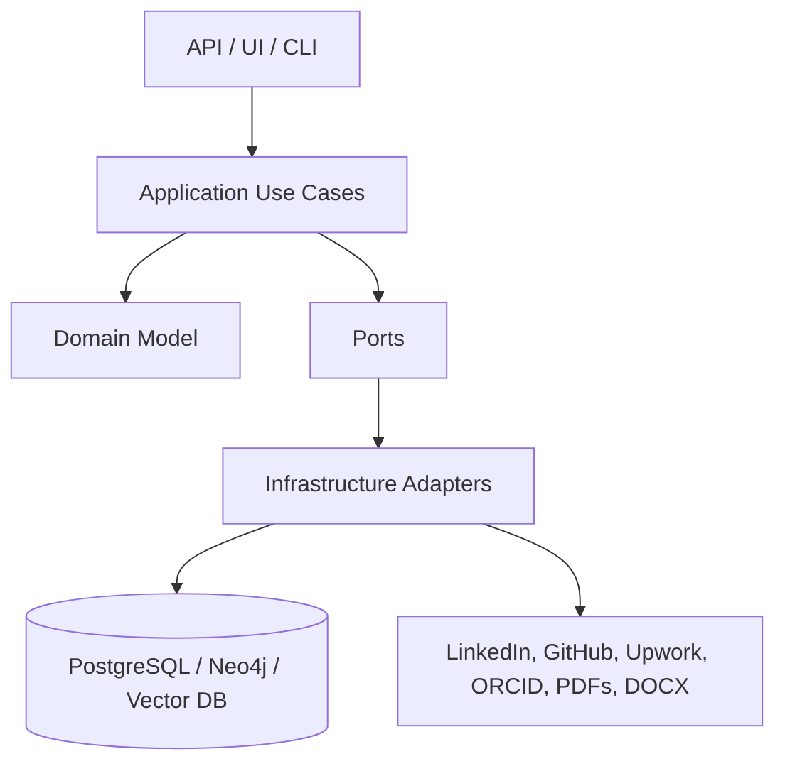

# Architecture Overview

## Style

CareerOS uses:

- Domain-Driven Design
- Clean Architecture
- Hexagonal Architecture
- Event-driven workflows
- Multi-agent orchestration
- Knowledge Graph + RAG

## Layers

## Why this architecture

This structure keeps the career domain independent from vendors, LLM providers, databases and ingestion sources. It supports long-term maintainability and makes the project suitable for open source collaboration.
