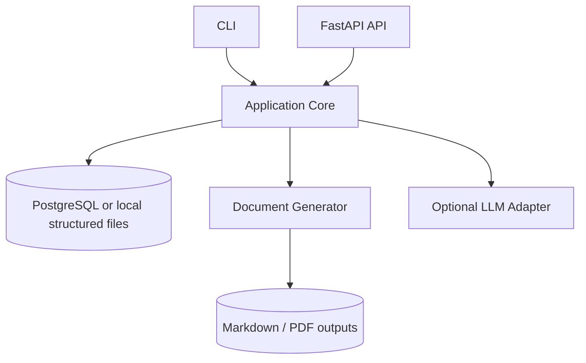

# Container View

## MVP containers

## Initial implementation recommendation

For the first real application:

- YAML or JSON for the user profile;
- YAML or Markdown for the opportunity;
- Python application service;
- Jinja2 or equivalent template engine;
- Markdown output;
- PDF export as a separate adapter;
- optional LLM adapter behind an interface.

PostgreSQL should be introduced when multiple users, concurrent access or richer querying become necessary.
