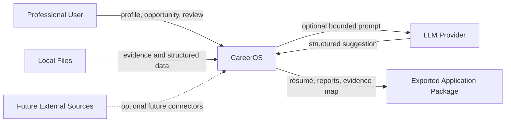

# System Context

## Trust boundary

CareerOS is the system responsible for:

- professional profile records;
- opportunity records;
- evidence references;
- generated artifacts;
- approval and audit metadata.

An LLM is an external reasoning service, not the source of truth.
