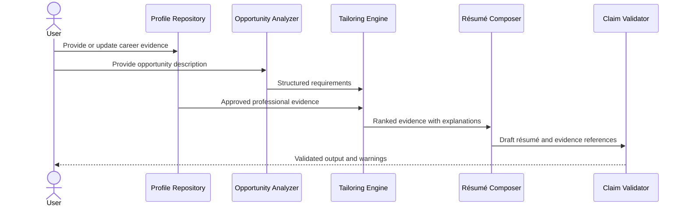

# Data Flow and Provenance

## Rule

Generated statements must preserve a connection to source evidence.

## Simplified flow

## Provenance fields

Every generated claim should support:

- claim identifier;
- source entity identifier;
- source type;
- source location;
- verification status;
- confidence;
- transformation explanation;
- generation timestamp;
- model or rule version;
- user approval status.
