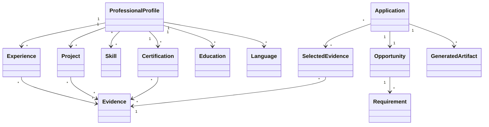

# Domain Model

## Initial bounded contexts

### Professional Identity

Owns the structured representation of the person's professional trajectory.

### Evidence

Owns sources, verification and provenance.

### Opportunity

Owns the representation of a role, contract, program or professional objective.

### Tailoring

Owns relevance, ranking and selection decisions.

### Application Documents

Owns document composition, templates, validation and export.

## Core entities

## Aggregates

### ProfessionalProfile aggregate

Protects consistency of professional records and their relationships.

### Opportunity aggregate

Protects opportunity requirements and extracted analysis.

### Application aggregate

Protects the relationship between one profile, one opportunity, selected evidence and generated artifacts.

## Important invariants

- a claim cannot be marked verified without evidence;
- an application must reference an opportunity;
- selected evidence must belong to the active profile;
- external artifacts require a validation result;
- user approval is required before final status.
